# Computer Vision-Based Structural Analysis and Statistical Quality Assessment of Textile Medical Implants

# Abstract

Textile medical implants exhibit complex fibrous architectures whose structural characteristics can directly affect their functional performance and manufacturing quality. Reliable and reproducible characterization of these structures is therefore essential for quality assessment and process monitoring. This study presents a computer vision-based framework for the automated structural analysis and statistical quality assessment of textile medical implants using microscopy images. The proposed approach was applied to two structurally distinct implant types: woven polyethylene terephthalate vascular grafts and braided Nitinol vascular stents. Image-processing and machine-learning methods were used to identify architecture-specific structural features. For the woven grafts, the framework quantifies parameters describing yarn arrangement and geometry, while for the braided stents, parameters such as braiding angle and cell geometry are extracted. The resulting structural descriptors are statistically evaluated to characterize their distributions and spatial variability and to identify deviations from the expected structural characteristics. In addition, machine-learning models are investigated for automated classification based on the extracted structural information and image data. The results demonstrate the potential of the proposed framework to provide objective and reproducible quantitative information on textile implant architectures. By combining automated feature extraction, statistical characterization, and machine-learning-based analysis, the approach provides a basis for structural quality assessment and can support data-driven quality and process-control decisions in the manufacturing of textile medical implants.

# Keywords
computer vision, textile medical implants, structural quality assessment, image analysis, machine learning, statistical analysis

# Introduction

## Background

### Textile Medical Implants and Their Structural Architecture

Textile-based materials are widely used in medical implants because their fibrous architecture can be tailored to provide specific mechanical and functional properties. Weaving, knitting, and braiding technologies are employed in vascular grafts and stent structures, where parameters such as porosity, compliance, and structural arrangement influence implant performance [@jfb6030500; @Bakare2024].

Woven and braided architectures are particularly relevant for vascular implants. Woven grafts consist of interlaced warp and weft yarns, with structural parameters such as yarn density and pore geometry affecting permeability and related functional properties [@Guan2021]. Braided implants consist of interlaced filaments or wires, where parameters including braiding angle, filament diameter, and strand number influence porosity and mechanical behaviour [@REBELO2015237; @ZHENG2019].

Despite their different architectures, both woven grafts and braided stents depend on the precise spatial organization of their constituent elements. Local variations in filament spacing, orientation, pore geometry, and density may occur within a manufactured structure and can contribute to structural variability. Microscopy-based image analysis therefore provides a suitable basis for quantitatively characterizing these structural features and their spatial distribution.

### Structural Parameters and Manufacturing Variability

The structural properties of textile medical implants can be described by geometric parameters that characterize the spatial organization of their constituent yarns or filaments. For woven structures, relevant parameters include yarn density, spacing, orientation, and pore geometry, whereas braided structures can be characterized by parameters such as braiding angle, filament diameter, and strand configuration [@REBELO2015237].

These parameters may vary locally within a manufactured structure. Image-based analysis provides a means of quantifying such variations objectively from microscopic images. Previous studies have demonstrated the automated analysis of woven structures based on parameters such as yarn spacing and orientation [@Kang2001], while more recent work has investigated image-based measurement of porosity-related parameters in woven fabrics [@Zupin2024].

Consequently, structural assessment should consider not only nominal parameter values but also their spatial variability. Statistical descriptors such as the mean, standard deviation, and coefficient of variation can be used to quantify structural uniformity and identify deviations within a textile structure. Such quantitative characterization provides a basis for assessing manufacturing variability and for developing automated approaches to structural quality assessment.

### Computer Vision for Automated Structural Characterization

Computer vision and image analysis have been used to automate the characterization of textile structures. Early approaches demonstrated the extraction of structural parameters from fabric images using image-processing techniques, including measurements of yarn spacing, orientation, and density [@Kang2001]. Subsequent research has expanded these approaches toward automatic recognition of woven fabric structural parameters, including fabric density and weave patterns [@Meng2022; @Xiang2022].

The development of machine learning has further extended image-based textile analysis. Convolutional neural networks have been applied to the recognition of textile structures directly from images [@Xiao2018], while neural approaches have also been investigated for extracting geometric yarn information from images [@Trunz2024]. These methods demonstrate the potential of learned image representations for automated structural characterization.

Beyond structural recognition, computer vision can also support automated quality assessment. Recent work has demonstrated the combination of computer vision and deep learning for quantitative yarn quality analysis [@Pereira2025]. However, the application of such approaches to textile medical implants requires consideration of their specific structural architectures and the need to characterize not only individual parameters but also their variability across an implant.

## Research Gaps

Existing research demonstrates the feasibility of automated image-based extraction and recognition of textile structural parameters, particularly for woven fabrics [@Kang2001; @Meng2022]. However, these approaches primarily address individual structural parameters or specific recognition tasks. Less attention has been given to combining multiple quantitative structural descriptors with statistical characterization of their spatial variability and subsequent quality classification. This is particularly relevant for textile medical implants, where structurally different architectures, such as woven vascular grafts and braided stents, require different structural descriptors while sharing the need for objective and reproducible assessment.

## Aim

The aim of this study is to develop and evaluate a computer vision-based framework for automated structural quality assessment of textile medical implants. The framework combines quantitative extraction of architecture-specific structural descriptors from microscopy images with statistical characterization of their spatial variability and machine learning-based classification.

# Materials and Methods

## 2.1. Framework Overview

The proposed framework follows a sequential workflow for automated structural quality assessment of textile medical implants. The main processing stages are illustrated in Fig. 1.

**Fig. 1. Workflow for structural quality assessment.**

The workflow comprises five main stages: image acquisition, preprocessing, structural feature extraction, statistical analysis, and decision-making. This sequence transforms microscopy images into quantitative structural descriptors and subsequently into statistical indicators for quality assessment.

## 2.6. Machine Learning Models

Three machine learning approaches were considered for structural quality classification: Random Forest, Multilayer Perceptron (MLP), and Convolutional Neural Network (CNN).

The Random Forest model was used to classify structural quality based on the extracted features. Its general structure is illustrated in Fig. 2.

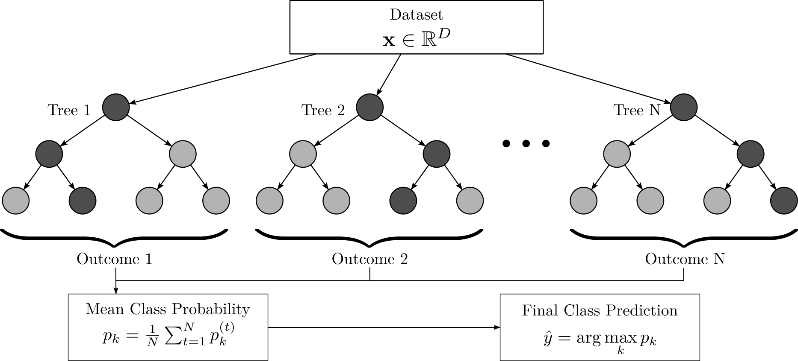

**Fig. 2. Random Forest model structure.**

The model combines multiple decision trees, with their individual predictions aggregated to obtain the final classification result.

The MLP model was also applied to the extracted structural features. Its general structure is shown in Fig. 3.

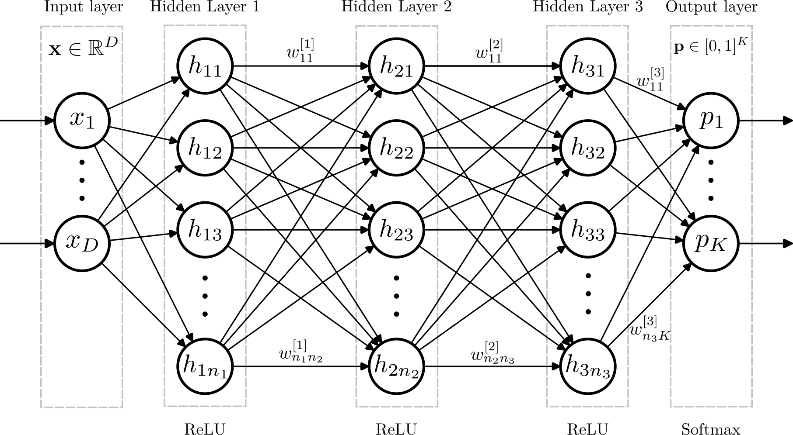

**Fig. 3. MLP model structure.**

The model consists of interconnected layers of neurons that transform the input features through successive nonlinear operations to obtain the final classification result.

In contrast, the CNN model was applied directly to image data. Its general structure is shown in Fig. 4.

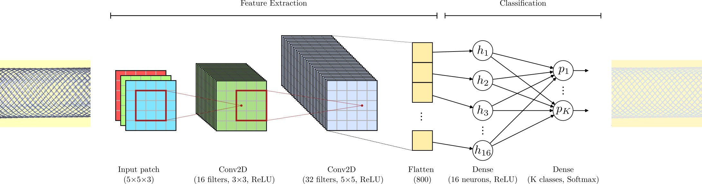

**Fig. 4. CNN model structure.**

The CNN extracts hierarchical visual features through convolutional layers and uses the learned representations for structural quality classification.

# Results and Discussion

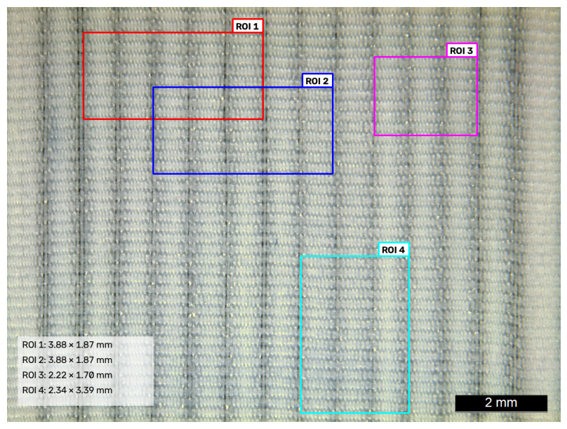

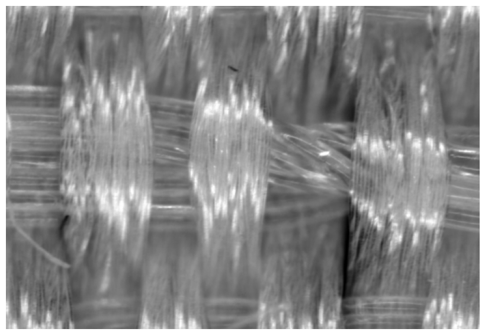

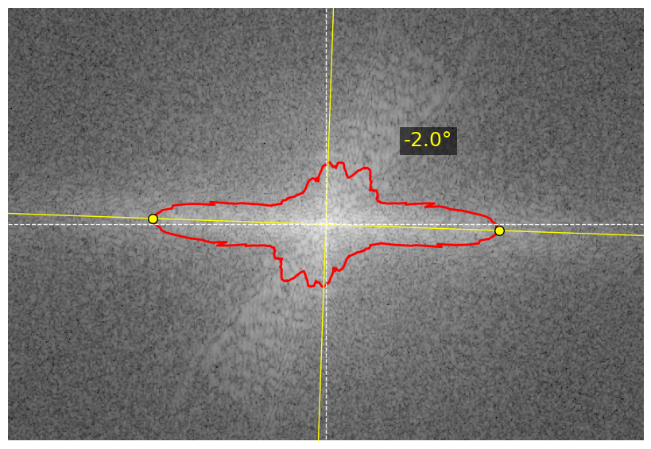

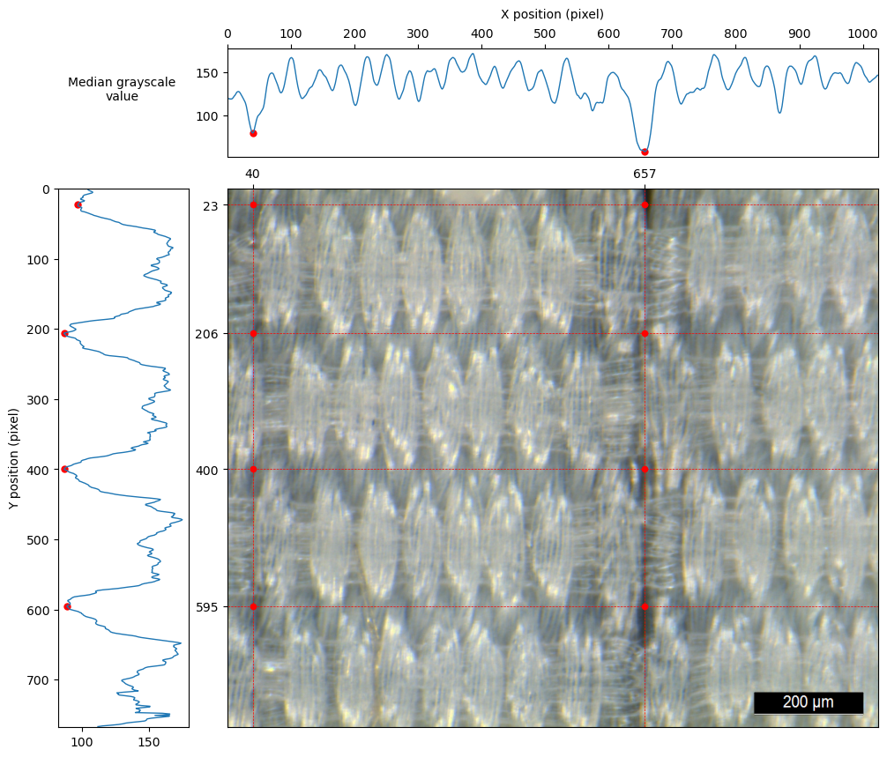

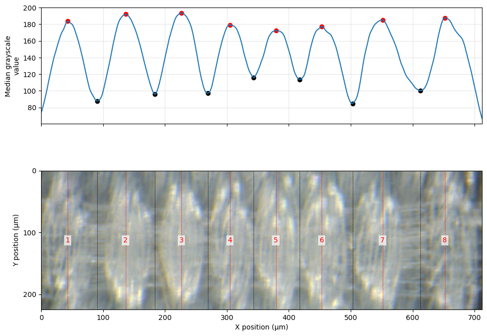

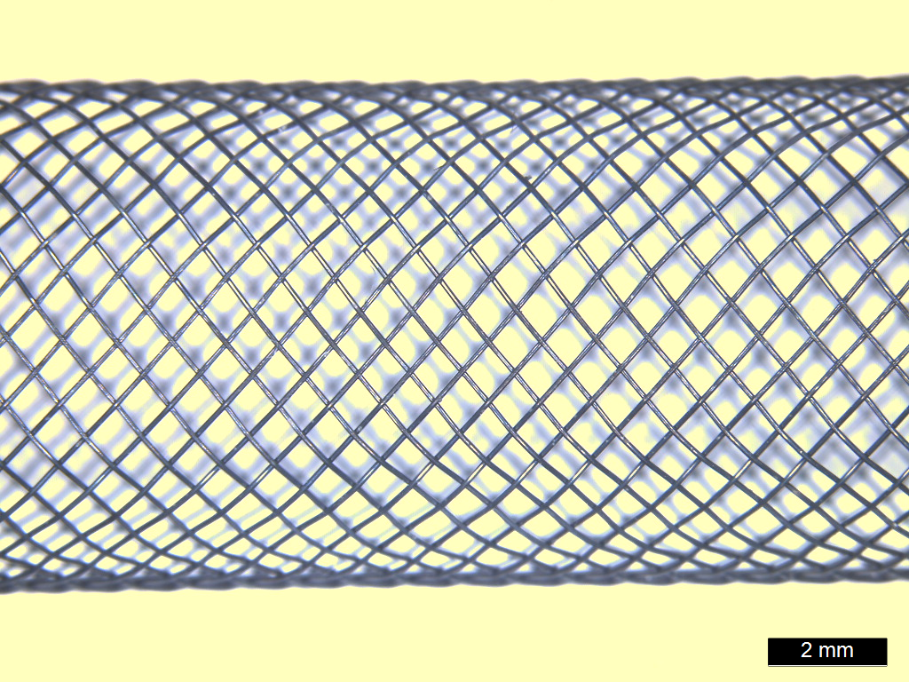

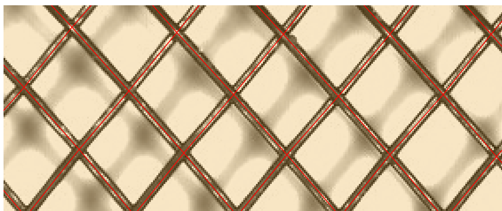

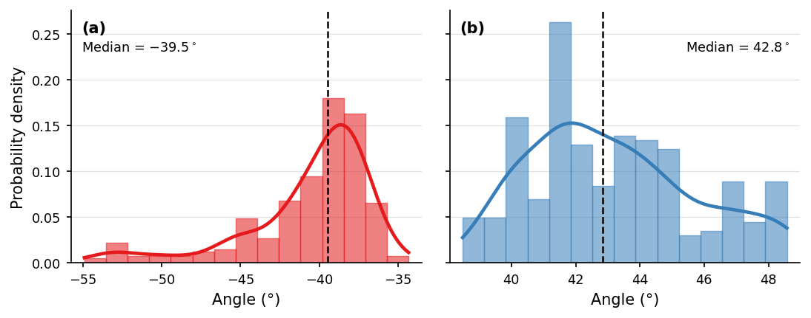

# Conclusions

The developed computer vision framework was applied to two structurally distinct types of textile medical implants: woven  vascular grafts and braided Nitinol vascular stents. For the woven grafts, the framework enables the extraction of structural descriptors related to yarn arrangement and geometry, while for the braided stents, architecture-specific parameters such as braiding angle and cell geometry are quantified from microscopy images.

The extracted structural descriptors are subsequently evaluated using statistical methods to characterize their distributions and spatial variability. This enables the assessment of structural uniformity and the identification of deviations from the expected structural characteristics. The resulting quantitative information can support quality assessment and provide a basis for data-driven decisions in manufacturing and process control.

# References